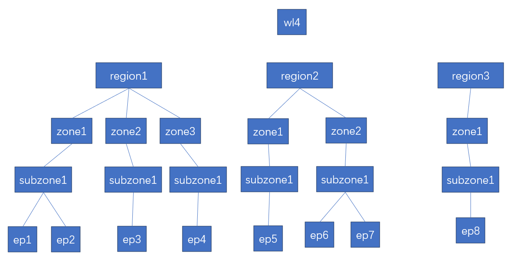
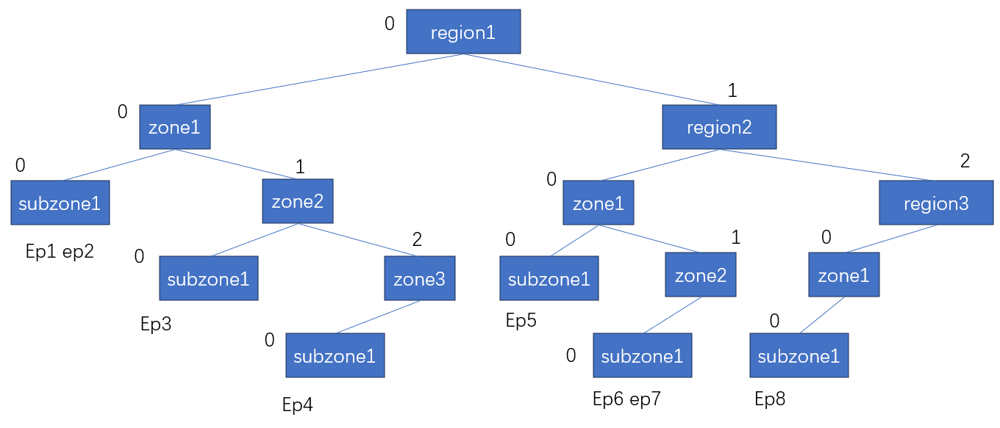

# 一种新的树型数据结构用于代替locality load balance中循环计算

在云场景的服务网格工具，比如istio，envoy和ztunnel中，有一种基于地理位置的负载均衡策略-Locality Load Balancing，它允许服务网格根据服务实例的位置（即“locality”）来决定请求如何被分发到不同的服务实例。这种策略特别适用于大型分布式系统，其中服务实例可能分布在多个数据中心或地理位置。

Locality Load Balancing有一个核心的计算逻辑，即通过源workload的locality信息与service中对应的所有backends的locality计算匹配值，然后依据匹配值决定优先选择哪个backend作为提供服务的后端。

- 匹配值的计算需要循环的对每一个backends进行计算，当后端数量较多时候，会引入额外的计算开销。
- 以kemsh为首的新型服务网格工具尝试在bpf中实现类似的负载均衡逻辑，但是已有的计算方式需要大量locality信息的维护，查询，而且循环计算在内核态是不适宜的。

下面是ztunnel中的locality load balance逻辑：

```rust
match svc.load_balancer {
            None => endpoints.choose(&mut rand::thread_rng()),
            Some(ref lb) => {
                let ranks = endpoints
                    .filter_map(|(ep, wl)| {
                        // Load balancer will define N targets we want to match
                        // Consider [network, region, zone]
                        // Rank = 3 means we match all of them
                        // Rank = 2 means network and region match
                        // Rank = 0 means none match
                        let mut rank = 0;
                        for target in &lb.routing_preferences {
                            let matches = match target {
                                LoadBalancerScopes::Region => {
                                    src.locality.region == wl.locality.region
                                }
                                LoadBalancerScopes::Zone => src.locality.zone == wl.locality.zone,
                                LoadBalancerScopes::Subzone => {
                                    src.locality.subzone == wl.locality.subzone
                                }
                                LoadBalancerScopes::Node => src.node == wl.node,
                                LoadBalancerScopes::Cluster => src.cluster_id == wl.cluster_id,
                                LoadBalancerScopes::Network => src.network == wl.network,
                            };
                            if matches {
                                rank += 1;
                            } else {
                                break;
                            }
                        }
                        // Doesn't match all, and required to. Do not select this endpoint
                        if lb.mode == LoadBalancerMode::Strict
                            && rank != lb.routing_preferences.len()
                        {
                            return None;
                        }
                        Some((rank, ep, wl))
                    })
                    .collect::<Vec<_>>();
                let max = *ranks.iter().map(|(rank, _ep, _wl)| rank).max()?;
                ranks
                    .into_iter()
                    .filter(|(rank, _ep, _wl)| *rank == max)
                    .map(|(_, ep, wl)| (ep, wl))
                    .choose(&mut rand::thread_rng())
            }
        }

```

> 其中ztunnel的service配置中，balancing scope以network，region，zone作为匹配依据。istio则以region，zone，subzone作为匹配依据。

### 本repo提出的解决思路：

在控制面收集backend信息的时候对locality信息进行分组管理，以键值表的形式存储不同地域下的最优匹配规则。

> 一个需要注意的点是：地理位置匹配是分层匹配，即region1,zone1和region2,zone1是两个地域。

最直观的想法是以森林的形式表示地域匹配，将backends分组。下图是森林化的示例。



这种情况下的locality匹配规则：源workload需要按照自己的locality，逐级去匹配查寻找对应树，如果找到树就逐级向下查找，最终在叶子节点中随机选择一个backend。如果在某一层没有找到对应的子树，则在同层的节点中随机选择一个子树进入下一层，随机选择后续的节点以找到一个相对匹配的随机backend。


但是对于bpf，森林无法高效的以bpf map的形式存储。一种思路是以数组的形式存储一个完全二叉树，这样只需给bpf传入一个字符串即可。

我们可以把森林转成一棵非完全二叉树，然后对非完全二叉树补全，以数组的形式存储一颗完全二叉树。

> 事实上，也可以直接按照树的特点构建这棵非完全二叉树。详见python示例代码。

我们可以构建如下的一棵非完全二叉树：



此时的locality匹配规则：对于这棵树，源workload需要按照自己的locality，逐级去右子树寻找匹配的节点，如果找到匹配的节点，则进入其左子树，递归的去左子树查询其右子节点，直到找到匹配的所有节点。如果中间某个环节没有匹配到节点，则就在所有右子节点中随机选择一个节点进入其左子树，递归的去随机选择左子树，直到找到一个路径。

在二叉树的结构中，可以不将真实的backend(endpoint) 存到树中。节点数据可以存储在一个hash表中，二叉树仅用作产生编码作为key查询，值则存储同地理位置的一组backend的uid。

> 在基于地理位置匹配的二叉树中，有一个特点，就是每个region节点必然有至少一个左子树zone，每个zone必然有至少一个subzone左子树，所以一定可以组成长度为3（region，zone，subzone）组成的键。


### 程序怎么开发？

对于用户态控制面，在维护进程插入workload的时候，对每个workload构建这课树，同时维护每种key对应的backend的集合。向内核态更新数据时，以数组形式将二叉树传入bpf map，以bpf hash map的形式传入编码key和对应的backend集合。

对于内核态bpf代码，负载函数依据workload的locality信息，根据region，zone，subzone依次在二叉树中进行分层匹配，最终会得到一个key，然后用key在hash map中查找对应的backend集合，从集合中随机选择一个backend作为服务。


### Todo and tips

- treemap.py实现了森林的构建，基于僧林的locality loadbalance逻辑，二叉树的构建，非完全二叉树转二叉树的逻辑，遍历数组形式二叉树获取编码key的逻辑等。
- 当前的验证算法是python实现的，有些算法的重复逻辑可以进一步优化。
- 当前只是以region，zone，subzone三种作为匹配规则（事实上，istio，ztunnel也支持三种），算法可以进一步优化以支持更多数量的匹配规则。
